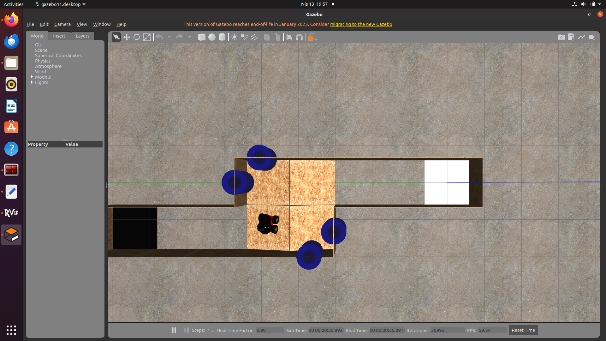

# ROS Maneuvering 1
 
In this assignment, the robot (P3AT) started moving from the starting position in a given Gazebo world, moved autonomously in a given environment, reached the finishing position and repeated this cycle continuously.

